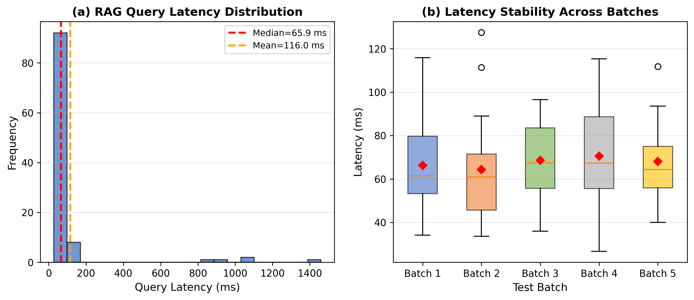
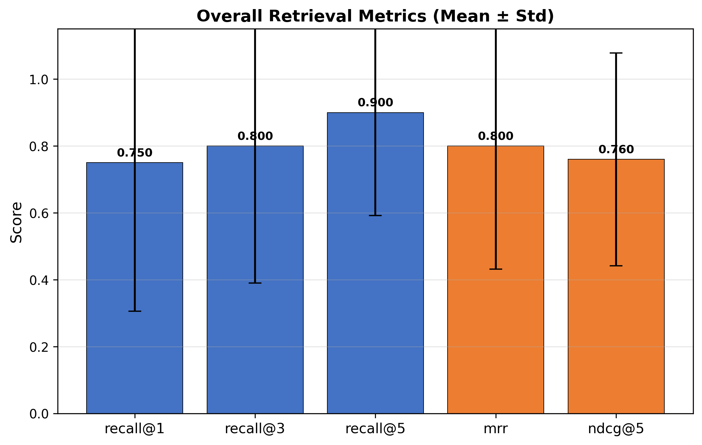
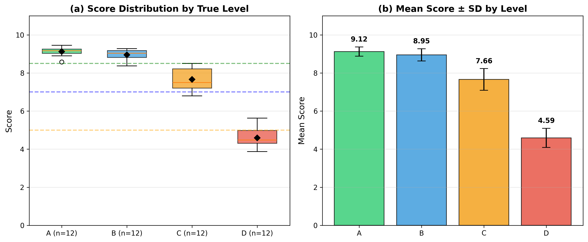
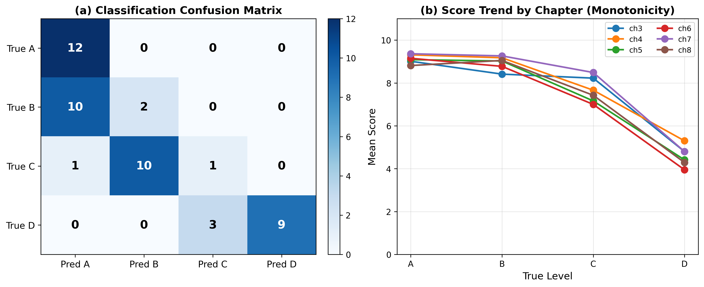
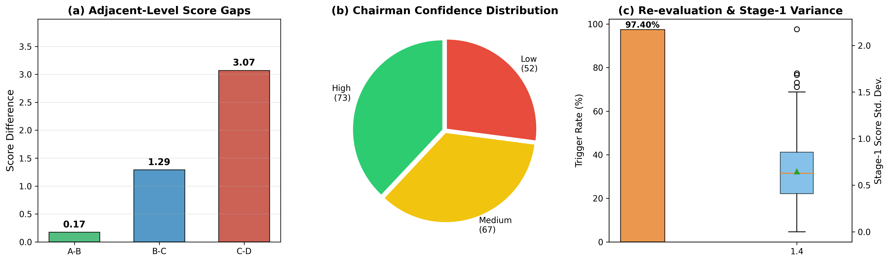
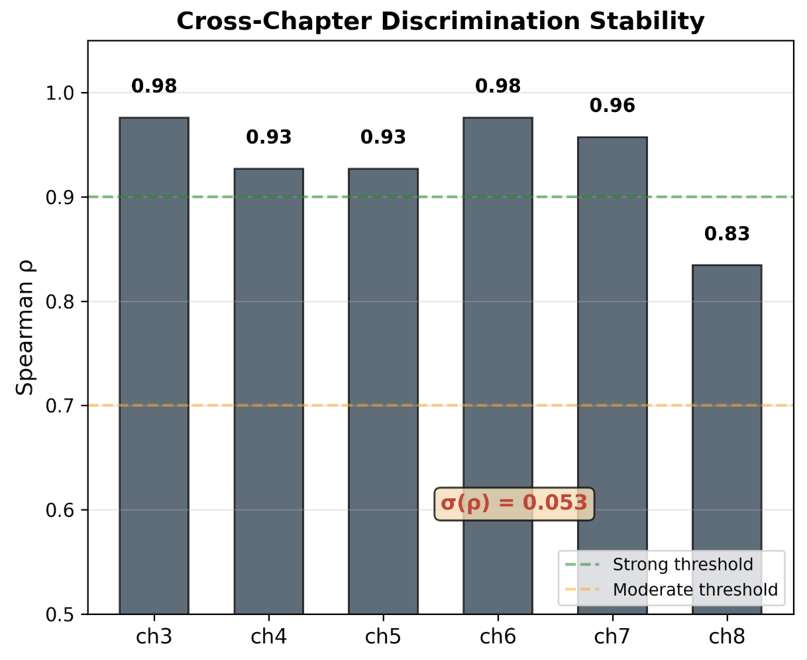

# AI考试系统的设计与实践
## 0 摘要
//todo
## 1 研究背景与意义
### 1.1 研究背景与意义
#### 1.1.1 大语言模型普及对传统编程作业评估的冲击
近年来，以GPT、Claude、Gemini为代表的大语言模型在代码生成、文本润色与知识问答等任务上展现出接近甚至超越人类专家的能力。这一技术突破在显著提升生产效率的同时，也对高等教育中的学术诚信与教学评估体系带来了前所未有的挑战。在编程类课程中，学生仅需向LLM提供自然语言描述，即可在数秒内获得结构完整、语法正确的代码实现；更有甚者，部分学生直接提交由LLM生成的实验报告，其行文流畅度与逻辑严密性往往令教师难以仅凭肉眼判别真伪。\
传统的代码相似性检测工具（如MOSS）主要防范学生之间的互相抄袭，却难以应对"人机协作"或"完全代写"的新型作弊模式。Gacek等人针对算法与数据结构课程的研究表明，即便学生仅对LLM生成的代码进行变量重命名或格式微调，基于代码嵌入的语义相似性检测仍能在一定程度上识别出高度可疑的提交[1]。然而，检测系统只能标记风险，无法衡量学生是否真正理解代码背后的设计思想。正如纽约大学Stern商学院PanosIpeirotis教授在其教学实践中的观察：许多提交了"thoughtful, well-structuredwork"的学生，在课堂随机追问下却无法解释其提交作品中的基本设计选择，甚至完全无法作答。这揭示了一个根本性问题——当书面作业可以被LLM高质量代劳时，传统的基于文本产出的评估方式正在逐渐失效[2]。
#### 1.1.2 操作系统课程实验考核的特殊性与困难
操作系统课程是清华大学计算机系本科阶段的核心必修课，其实验环节要求学生深入理解进程管理、内存管理、中断处理、文件系统等底层机制，并在ucore或rcore教学操作系统内核框架上完成代码补全与功能扩展[3]。与其他编程课程相比，OS实验具有三个显著特点：其一，代码上下文高度复杂，单个实验往往涉及数十个源文件、数百个函数调用关系，学生需要对内核整体架构有宏观把握；其二，实验答案具有强开放性，同一道题目可能存在多种实现路径，教师难以通过简单的测例或代码查重完成评判；其三，实验强调对底层机制的理解而非单纯的代码编写，例如页替换算法的设计决策、中断上下文的保存与恢复流程等，均需要学生具备扎实的概念认知与调试能力。\
这些特点使得OS实验成为LLM辅助作弊的"重灾区"：学生可以轻易让LLM生成一段"看起来正确"的代码片段，甚至借助LLM撰写一份详尽的实验报告，但其对时钟中断处理流程、页表项与物理页映射关系等核心知识点的理解可能极为薄弱。与此同时，由于班级规模较大，教师与助教难以对每一份实验代码进行逐行审阅与面对面追问，导致评估质量与效率之间的矛盾尤为突出。
#### 1.1.3 AI口试作为防作弊评估手段的必要性与可行性
面对LLM对书面评估的侵蚀，教育界开始重新审视口试这一传统评估形式的价值。口试要求考生在实时交互中展示其对知识的理解、逻辑推理与即兴表达能力，这种"实时性"与"交互性"天然提高了LLM代答的门槛——考生无法像完成书面作业那样，在不受监督的环境下通过多轮对话让LLM代为组织答案。然而，传统口试长期以来面临一个根本性的可扩展性瓶颈：以36名学生、每场25分钟、两名考官计算，仅考试与评分环节就需要消耗约30小时的教师工时；当班级规模扩大至百人以上时，人工口试几乎不现实。\
语音AI技术的成熟为破解这一困境提供了新的可能。Ipeirotis与Rizako在2025年底至2026年初开展了一项具有里程碑意义的教学实验：他们利用ElevenLabs对话式AI平台构建语音考官代理，为NYU的"AI/ML产品管理"课程实施了36场自动化口试，总成本仅为15美元（约合每名学生0.42美元）并实现了三模型协作评分与结构化反馈生成。这一思路不仅在经济成本上具有颠覆性，更在教育理念上具有深远意义：由于LLM可根据评分细则动态生成问题，考试结构本身可以完全公开，学生通过反复练习系统来备考而"练习即学习"，从根本上消除了泄题风险[2]。
#### 1.1.4 构建自动化AI考试系统的教育价值与技术意义
将语音AI口试技术引入操作系统课程实验评估，具有双重价值。在教育层面，它有望建立一种"代码提交+即时口试"的闭环评估机制：学生上传实验代码后，AI考官不仅针对代码实现细节进行追问，还能结合操作系统核心概念展开深度探查，从而有效区分"亲手实现并理解"与"复制粘贴LLM输出"两类学生。在技术层面，该场景对现有AI评估技术提出了新的挑战与要求：操作系统领域的专业知识需要构建专门的检索增强生成知识库以提升出题与追问的专业性；实验代码的复杂性与开放性要求评分系统具备多维度、可解释的评判能力；语音交互的实时性则对系统架构的并发处理与稳定性提出了工程层面的要求。\
因此，本研究旨在设计并实现一套面向操作系统课程实验的AI口试系统，集成自动出题、实时语音交互、多LLM协作评分与置信度检验等核心功能，以期为LLM时代的编程课程评估提供一种可落地、可扩展、可信赖的技术方案。
### 1.2国内外研究现状
#### 1.2.1 基于LLM的自动出题与代码评估技术
自动出题（Automatic Question Generation,AQG）是自然语言处理与教育技术领域的经典研究方向。传统方法主要依赖模板填充或语法规则，生成的问题在灵活性与上下文关联性上存在明显局限。LLM的出现显著提升了AQG的质量：通过精心设计的提示词工程，模型能够基于给定的知识点、代码片段或学生作业生成具有针对性与层次感的问答题目。在编程教育场景中，LLM不仅可以生成概念性问题，还能针对学生提交的代码提出特定的调试追问，例如要求解释某一行关键代码的设计意图或边界条件处理逻辑。\
在代码评估方面，现有研究主要沿两条路径展开。一是静态检测路径，通过代码嵌入、抽象语法树（AST）比对或风格特征提取，识别LLM生成或改写过的代码提交[1]。二是动态执行路径，利用测试用例验证代码功能正确性。然而，前者在识别的可靠性和泛用性上仍有待验证。后者则侧重于"代码本身"而非"代码作者的理解"，无法回答"学生是否真正掌握了这段代码"这一教育评估的核心问题。
#### 1.2.2 多模型协作评估研究进展
单一LLM在评判开放式任务时往往存在评分偏差与标准漂移问题。为提升评估的鲁棒性与一致性，研究者提出了多模型协作评估框架，即让多个不同架构或不同训练数据的大模型独立评分，再通过某种聚合机制得出最终结论。AndrejKarpathy提出的"council of LLMs"思想是该方向的代表性方案之一[4]。\
Ipeirotis与Rizakos在其语音口试系统中将这一思想具体化为三阶段评分流程：第一阶段，Claude、Gemini与GPT三个模型独立阅读考试转录文本并给出各维度评分；第二阶段，每个模型审阅其余两个模型的评分依据与引用证据，并据此修订自身评分；第三阶段，由指定的"主席模型"综合所有信息生成最终成绩与结构化反馈。实验数据显示，经过协商修订后，评分者间一致性的Krippendorff'sα系数达到0.86，显著高于传统阈值。不过，该研究也指出，当学生回答本身含糊不清时，模型间仍会在"部分得分"的判定上存在分歧，这提示多模型评估机制仍需配合置信度检验与人工审计[2]。
#### 1.2.3 语音交互在在线考试系统中的集成现状
语音作为最自然的人机交互模态之一，近年来随着端到端语音识别（ASR）与神经网络语音合成（TTS）技术的成熟，逐渐被引入在线教育场景。ElevenLabs、GoogleCloudSpeech-to-Text等平台已将ASR、TTS、话轮转换与打断处理等能力打包为对话式AI服务，使得构建语音考官的技术门槛大幅降低。在招聘面试场景中，AI主持的语音面试在质量上可以达到甚至超越人工面试的水平，这为语音评估技术在高风险教育场景中的应用提供了信心。\
尽管如此，现有语音考试系统多聚焦于通用知识问答或商业案例分析，鲜有针对计算机专业编程实验的垂直场景设计。操作系统实验考核要求语音系统能够理解并播报技术术语、处理代码片段的朗读与展示，并在考生回答涉及底层实现细节时进行有效追问，这对语音交互的领域适配性提出了更高要求。
#### 1.2.4 RAG技术在垂直领域教育问答中的应用
检索增强生成（RAG）通过在外部知识库中检索与查询相关的文档片段，并将其作为上下文注入LLM的生成过程，有效缓解了模型幻觉问题，并提升了专业领域问答的准确性[6]。在教育场景中，RAG已被用于构建课程知识库、辅助答疑与生成学习材料[7]。对于操作系统课程而言，RAG知识库可以收录实验指导书、内核源码注释、历年优秀实验报告以及常见错误案例，从而为自动出题与深度追问提供领域知识支撑。
#### 1.2.5 现有研究的不足与本研究的定位
综合上述分析，当前研究存在以下不足：第一，现有的LLM代码检测与自动评估工具侧重于"识别抄袭"，缺乏对"理解深度"的测评手段；第二，已有的语音AI口试系统主要面向商业与管理类课程，尚未针对操作系统等底层系统类课程的实验特点进行专门设计；第三，多模型协作评分框架虽已初步验证其有效性，但在评分离群值检测、置信度量化与自动重评机制方面仍缺乏系统性研究；第四，RAG技术与语音口试系统的结合尚处于概念阶段，缺乏完整的工程实现与教学实验验证。\
本研究正是在上述背景下展开，定位于填补"垂直领域+语音交互+RAG知识增强+多模型可信评分"这一交叉空白，设计并实现一套完整的AI口试系统，以期为LLM时代的计算机专业实验课程评估提供可复用的技术框架与实践参考。
### 1.3 研究内容与目标
#### 1.3.1 核心研究问题界定
本研究围绕大语言模型时代操作系统课程实验评估所面临的现实困境展开，核心研究问题可归纳为以下四个层面：\
（1）LLM普及背景下OS实验代码的真实性评估困境。随着GPT、Claude等通用大语言模型在代码生成任务上的能力跃升，学生可轻易获取与实验要求高度匹配的代码实现，甚至借助LLM撰写完整的实验报告。现有基于代码相似性检测（如MOSS）或静态特征嵌入的抄袭识别工具，仅能标记"人机协作"的风险痕迹，却无法判定学生是否真正理解代码背后的内核机制。这导致传统以书面代码提交为核心的评估方式逐渐失效，教师难以区分"亲手实现并深刻理解"与"复制粘贴LLM输出"两类学生。\
（2）传统口试在OS实验场景中的可扩展性瓶颈。口试通过实时交互与即兴追问，天然具备防范LLM代答的优势，能够有效检验学生对实验代码的真实理解深度。然而，传统人工口试面临严峻的规模化困境：以百人规模的OS实验班级为例，若按每名学生20–30分钟、配备双考官计算，完成一轮实验口试需要消耗数百小时的教师工时，在现有教学资源配置下几乎不可行。因此，如何在保持口试评估效度的同时，突破其可扩展性瓶颈，成为亟待解决的关键问题。\
（3）通用AI评估工具缺乏操作系统领域的专业适配性。现有基于LLM的自动出题与评分系统多面向通用知识问答或商业案例分析，其知识库与评估标准难以直接迁移至操作系统实验场景。OS实验涉及大量底层概念、复杂的内核源码上下文以及开放性的实现路径，要求出题与评分系统具备领域知识增强能力。如何构建面向ucore和rcore教学操作系统的专业知识库，并设计基于检索增强生成（RAG）的自动出题机制，是本研究需要解决的核心技术问题之一。\
（4）单一LLM评分的主观性与不稳定性。开放式实验问题的评分具有高度主观性，单一LLM在评判时易受模型训练偏差、提示敏感性及上下文长度限制的影响，导致评分标准漂移与结果波动。现有研究虽已提出多模型协作评估的初步框架，但在评分离群值检测、置信度量化及自动重评机制方面仍缺乏系统性设计。如何构建一套鲁棒、可解释且具备自我修正能力的多维度评分体系，是保障AI口试评估效力的关键。
#### 1.3.2 系统设计目标
针对上述研究问题，本研究旨在设计并实现一套面向操作系统课程实验的AI自动化口试系统，具体系统设计目标如下：\
（1）基于RAG知识增强的自动出题模块。系统应能够接收学生提交的实验代码，自动解析其修改的源码文件与关键函数，并基于构建好的OS领域RAG知识库检索相关上下文，生成具有专业性、针对性与层次感的口试问题。问题应覆盖代码实现细节、设计决策依据与底层概念理解三个维度，并通过互异性检查机制避免重复提问。同时，系统需支持ucore与rcore两种教学操作系统知识库的动态切换，以适应不同教学场景。\
（2）低延迟、高稳定的实时语音口试交互系统。系统应集成自动语音识别（ASR）与文本转语音（TTS）技术，构建基于WebSocket的全双工语音通信通道，实现"语音播报题目—考生语音回答—实时转写与理解"的闭环交互。考试界面需支持代码片段的同步展示与语音播报的双模态呈现，确保考生在回答涉及源码细节的问题时能够直观参照。系统还需具备考试状态机管理、超时处理、异常恢复及OS专用口试模式与普通调试模式的双模式适配能力。\
（3）多维度、可解释的多LLM协作智能评分模块。系统应设计三阶段评分流程：第一阶段由多个异构LLM独立对考生回答进行多维度评分（正确性、完整性、深度、代码理解程度）并生成结构化分析报告；第二阶段实施模型间交叉评审，每个模型审阅其余模型的评分依据并修订自身评分；第三阶段由主席模型综合所有评分与交叉评价生成最终成绩与反馈。此外，系统需引入基于统计离群值检测的置信度检验机制，对显著偏离的评分自动触发重评，并将重评结果纳入最终裁决，以提升评分的一致性与可信度。
## 2 相关技术
### 2.1 大语言模型技术
#### 2.1.1 生成式预训练模型原理
当前大语言模型（LargeLanguageModels,LLMs）的发展以OpenAI的GPT系列为代表，其核心架构建立在Vaswani等人于2017年提出的Transformer之上。Radford与Narasimhan在2018年提出的Generative Pre-trained Transformer（GPT）首次验证了"无监督预训练+有监督微调"的两阶段范式：模型首先在大规模无标注文本上进行生成式预训练，学习语言的通用表示；随后针对具体下游任务进行微调，仅需少量标注数据即可获得优异性能。GPT采用仅解码器（decoder-only）的Transformer架构，通过掩码自注意力机制实现从左到右的文本生成，其1.17亿参数的规模在当时已刷新多项语言理解基准[8]。\
该范式在后续工作中被持续放大。Radford等人于2019年发布的GPT-2将参数量扩展至15亿，并引入WebText数据集进行无监督多任务学习，验证了模型在不依赖下游微调的情况下通过提示完成零样本任务的能力[9]。Brown等人于2020年进一步将GPT-3扩展至1750亿参数，系统性地证明了大规模语言模型具备少样本学习（few-shotlearning）能力，仅需在提示中提供少量示例即可适应新任务[10]。Kaplan等人提出的"Scaling Laws"则从理论上揭示了模型性能随参数量与数据量增长的幂律关系，为后续大模型的规模化发展奠定了理论基础[11]。\
然而，单纯扩大模型规模带来了安全性、价值观对齐与指令遵循等方面的挑战。Ouyang等人于2022年提出的InstructGPT引入"基于人类反馈的强化学习"，通过训练奖励模型对人类偏好进行建模，并使用近端策略优化（Proximal Policy Optimization,PPO）算法对预训练模型进行微调，显著提升了模型生成有用、诚实且无害回复的能力[12]。RLHF现已成为GPT-4、Claude等主流对话模型的标准后训练流程。
#### 2.1.2 基于提示词工程的代码分析
提示词工程是指通过精心设计的输入模板引导LLM完成特定任务的技术。在代码分析场景中，提示词工程的有效性体现在两个层面：其一，通过角色设定与任务描述，引导模型以代码审查者或调试专家的身份进行推理；其二，通过上下文学习（in-context learning）在提示中嵌入代码片段、错误日志或相关文档，使模型能够基于有限示例理解特定代码库的结构与语义。\
代码分析任务对提示设计提出了特殊要求。由于程序代码具有严格的语法结构与执行语义，提示需要兼顾自然语言描述与形式化表示。研究表明，将代码的抽象语法树（AST）路径或控制流信息以结构化方式嵌入提示，可显著提升LLM在代码理解、漏洞检测与程序修复任务上的表现[13]。此外，链式思维提示通过要求模型分步推理，能够有效改善复杂代码逻辑的分析质量[14]。
#### 2.1.3 多Agent协作机制
随着单一LLM在复杂任务上的局限性逐渐显现，研究者开始探索多Agent协作机制。Tran等人于2025年发表的综述系统性地梳理了LLM多Agent系统的协作维度，包括参与者、协作类型、通信结构与协调策略。在集中式结构中，一个中心Agent作为协调枢纽聚合多个LLM的响应，例如LLM-Blender通过成对排序融合不同模型的输出；在分层结构中，AgentVerse等框架将Agent按功能分层组织，实现复杂任务的分解与协作求解[15]。\
多Agent协作在评估任务中的应用尤为关键。Liang等人提出的ChatEval框架通过多Agent辩论机制，让多个LLM以评审者身份相互质疑与修正，从而提升开放式生成任务的评估质量[16]。这一思想与本研究中多LLM协作评分的核心设计高度契合。
###2.2检索增强生成（RAG）技术
#### 2.2.1 RAG基本架构
检索增强生成（Retrieval-Augmented Generation,RAG）由Lewis等人于2020年提出，旨在通过外部知识检索弥补LLM在知识密集型任务中的固有缺陷[17]。其核心架构包含两个模块：检索器负责从外部知识库中召回与查询语义相关的文档片段；生成器则将检索到的上下文与原始查询拼接后输入LLM，引导模型生成基于事实的回复。该架构有效缓解了LLM的知识截止、参数化知识静态化及幻觉等问题[18]。
#### 2.2.2 向量数据库与语义检索
向量数据库是RAG系统的核心基础设施，负责存储文档的稠密向量表示并支持高效的近似最近邻（Approximate Nearest Neighbor,ANN）检索。ChromaDB作为轻量级开源向量数据库，因其易于集成、支持内存检索与持久化存储等特性，在学术研究中被广泛采用。其底层通常基于Hierarchical Navigable Small World（HNSW）算法实现子线性复杂度的语义相似性搜索。\
语义检索的质量高度依赖嵌入模型的选择。Zhang等人的研究表明，Qwen3-Embedding系列通过大规模合成数据预训练与领域微调，在代码检索等特定领域任务上取得了显著的性能提升[19]。此外，多项实证研究也证实，在垂直领域中对通用嵌入模型进行领域微调，可使检索准确率提升5%–10%甚至更高[20]。在RAG流水线中，文档首先被切分为适当长度的文本块，经嵌入模型编码为向量后存入ChromaDB；查询时通过余弦相似度计算召回最相关的top-k文档片段[17]。
### 2.3 语音处理技术
#### 2.3.1 自动语音识别（ASR）原理与开源方案
自动语音识别（Automatic Speech Recognition,ASR）旨在将音频信号转换为文本序列。现代ASR系统主要基于深度神经网络架构，包括基于Transformer的编码器-解码器模型与基于Connectionist Temporal Classification（CTC）的流式识别模型。在开源生态中，sherpa-onnx项目提供了基于ONNXRuntime的高效推理框架，支持多种预训练模型的本地部署，包括SenseVoice等多语种语音识别模型[21]。FunASR则是阿里巴巴达摩院推出的开源语音识别工具包，集成了Paraformer等高性能模型，在中文语音识别任务上表现优异[22]。这些开源方案为构建低延迟、高可用的语音考试系统提供了技术基础。
#### 2.3.2 文本转语音（TTS）技术
文本转语音（Text-to-Speech,TTS）技术经历了从拼接合成到参数合成再到神经网络端到端合成的演进。当前主流的神经网络TTS模型（如VITS、Bark、GPT-SoVITS）能够生成自然度接近真人的语音，并支持语速、语调与音色的调控。在考试场景中，TTS不仅需要准确播报题目文本，还需处理技术术语（如sys_trace、trapframe）的特殊发音，这对语音前端处理（textnormalization）提出了额外要求。
#### 2.3.3 实时语音流处理与WebSocket通信
实时语音交互要求系统具备低延迟的双向通信能力。WebSocket协议通过建立持久化的全双工连接，避免了HTTP轮询带来的额外开销，成为语音流实时传输的标准方案。在考试场景中，前端通过WebSocket将音频流分段发送至后端ASR服务，后端完成识别后通过TTS合成回复音频并回传，形成"收听—识别—理解—合成—播放"的完整交互闭环。
###2.4多模型集成评估方法
#### 2.4.1 单模型评估的局限性
使用单一LLM作为自动评估器虽然操作简便，但存在系统性偏差风险。Li等人于2024年发表的综述系统梳理了LLM评估器面临的核心挑战，包括位置偏差、长度偏差、自我偏好偏差及提示敏感性[23]。Koo等人在ACL2024上发表的实证研究进一步量化了这些认知偏差：在16个不同规模的LLM评估器上，约40%的比较判断中出现了显著的自我偏好（即模型倾向于给自己的输出更高评分），且机器偏好与人类偏好的Rank-BiasedOverlap（RBO）得分仅为44%，表明现有LLM评估器与人类判断存在明显错位[24]。
#### 2.4.2 多模型投票与一致性检验方法
为缓解单模型评估的偏差，研究者提出了多模型协作评估（Multi-LLMEvaluation）框架。其核心思想是让多个异构LLM独立对同一输出进行评分，再通过投票或加权聚合得出最终结论。Chan等人提出的ChatEval框架通过多Agent辩论机制，让不同模型相互评审并修正评分，显著提升了评估的一致性[25]。在聚合策略上，除简单多数投票外，还可采用基于置信度的加权平均，或引入元评审模型对多模型输出进行更高层次的综合裁决。\
评估一致性的量化通常采用Krippendorff'sAlpha（α）系数，该指标能够处理不同评卷者数量不一致的情况，并适用于名义、序数与区间等多种数据类型。在LLM评估研究中，α>0.8通常被视为高度一致，0.667≤α<0.8为可接受范围[26]。
#### 2.4.3 离群值检测与鲁棒性评估
多模型评估中，个别模型可能因训练偏差、提示敏感性或领域知识不足而产生显著偏离群体共识的评分。识别并处理这类离群值是保障评估鲁棒性的关键环节。统计上常用的离群值检测方法包括基于四分位距（Interquartile Range,IQR）的Tukey围栏法与基于标准差的Z-score方法。IQR方法通过计算评分分布的第一四分位数（Q1）与第三四分位数（Q3），将超出[Q1−1.5×IQR,Q3+1.5×IQR]范围的评分判定为离群值，该方法对非正态分布具有较好的鲁棒性。\
在检测到离群评分后，系统可触发自动重评机制：要求偏离模型在补充上下文或修正提示后重新评分，并将重评结果与原始评分一并提交给元评审模型进行综合裁决。这一机制有效降低了单一模型异常输出对最终评估结果的干扰，提升了多模型评估体系的可靠性。
## 3 系统设计
### 3.1 需求分析
本研究面向的核心场景是操作系统课程实验的自动化口试评估。与一般在线考试系统不同，本系统并不以批量生成选择题或静态判题为主要目标，而是围绕学生提交的OS实验代码，构建一个能够发现代码变更、提出针对性问题、通过语音交互追问并最终形成可信评分报告的闭环。
#### 3.1.1 功能需求
系统的功能需求可以分为五类。第一，代码提交与差异分析。考生需要提交修改前和修改后的实验代码压缩包，系统需从压缩包中提取C、Rust、汇编、Makefile、Markdown等与OS实验相关的文件，过滤'target'、'build'、'.git'等无关目录，并计算新增、删除、修改文件及变更行号。该需求对应项目中的'CodeExtractor'与'DiffAnalyzer'，是后续出题的输入基础。\
第二，自动出题。系统应根据实验要求、代码差异、关键变更类型以及课程知识库检索结果生成口试主干问题。问题不能停留在泛泛的概念回忆层面，而应直接关联学生修改过的代码片段，覆盖概念理解、实现细节、调试能力、优化思考和整体设计理解等类型。实际实现中，"questions/os_proposer.py"将问题封装为"ProposedQuestion"，每个问题包含题目文本、类别、出题理由以及若干"code_snippets"，供前端展示和语音口试使用。\
第三，实时语音口试。系统需要在前端展示问题和代码片段，同时以语音形式播报问题，并采集考生语音回答。考官不能仅按固定脚本念完题目，而应支持追问、重复、解释、提示和跳题等交互动作。项目中的"OralExaminer"通过状态机维护当前题目、追问深度、考试轮次和超时状态；"OSOralExamSession"则将OS出题器生成的问题作为主线，在学生回答后调用大模型生成围绕当前问题的动态追问。\
第四，自动评分与结果反馈。系统需要把口试过程中的问题和学生回答整理为问答对，提交给多模型评分委员会，输出每题分数、等级、置信度、主席评语以及整体理解程度、知识漏洞和学习建议。该功能由"llm-council/backend/council.py"的三阶段评分流程和"server.py"中的"chairman_overall_assessment"共同完成。\
第五，过程记录与复盘。系统应保存考试会话、对话转写、代码片段引用、评分结果和总体评估，供教师复核。当前原型采用内存型"EvaluationStorage"管理会话数据，并在OS出题阶段将生成的问题集保存为JSON与Markdown文件，便于调试和追踪。
#### 3.1.2 非功能需求
在非功能需求方面，首先是实时性。语音口试要求系统在考官发问、考生作答、ASR转写、LLM追问和TTS播报之间保持较低延迟。系统采用FastAPI异步接口与WebSocket长连接，避免频繁轮询；耗时的LLM出题和语音识别任务通过异步任务或线程池执行，减少阻塞。\
其次是可靠性。口试过程可能出现网络断开、考生长时间沉默、ASR失败、TTS生成失败或LLM响应格式异常等问题。系统通过心跳包检测连接状态，通过超时监控进行分级提醒，并在评分阶段设置解析失败回退逻辑。例如，当主席模型不可用时，评分模块可退化为使用教师模型平均分。\
再次是可扩展性。OS课程存在ucore与rcore两个不同的教学系统，知识库、代码语言和实验结构均不完全一致。因此系统在RAG工具层引入"COLLECTION_MAP"，将ucore和rcore分别映射到独立的ChromaDB collection；前端也提供课程类型选择，使同一套口试流程能够适配不同OS实验框架。\
最后是可解释性。系统的评估结果必须能够向教师和学生说明依据。为此，出题模块保留检索工具调用、代码变更摘要和出题理由；评分模块保留各模型独立评分、同行评议排序、分数分布和主席裁定文本；前端则展示多维评分、置信度和具体反馈。
#### 3.1.3 用户角色分析
系统主要涉及两类用户。考生负责上传代码、进入语音口试、查看或接收反馈。考生在口试过程中不仅回答主干问题，也可以通过'请重复''解释一下''给点提示''下一题'等指令控制对话节奏。教师或管理员负责配置课程类型、实验要求、题目数量、知识库内容和评分模型，并对低置信度结果进行抽查复核。由于本系统的目标是减轻助教口试负担，而非完全替代教师判断，因此教师仍保留对最终成绩的解释权和干预权。
### 3.2 系统架构设计
#### 3.2.1 前后端分离架构
系统采用React前端与FastAPI后端分离的架构。前端位于'frontend/src/App.tsx'，提供OS实验口试入口、代码压缩包上传、课程类型选择、语音控制面板、对话记录展示和结果页。后端位于'api/server.py'，统一提供HTTPAPI与WebSocket入口。HTTP接口用于启动考试、上传代码、生成问题、提交文字答案和查询结果；WebSocket接口用于承载实时语音口试中的控制消息、音频二进制数据与考官响应。\
该架构的优点在于将交互逻辑和评估逻辑分离。前端专注于录音、播放、状态展示和代码片段渲染；后端专注于代码分析、RAG出题、口试状态管理、ASR/TTS和多模型评分。二者通过JSON消息约定交互，使语音模块和评分模块可以独立演进。
#### 3.2.2 核心模块划分
系统核心模块包括五部分。\
（1）代码差异分析模块。该模块接收修改前、修改后的zip文件，提取源码文件并使用'difflib.unified_diff'生成统一diff，再记录新增文件、删除文件、修改文件和变更行号。'OSExperimentAnalyzer'进一步根据关键词识别变更涉及的OS领域，例如内存管理、进程调度、同步互斥、文件系统、中断和启动流程。\
（2）RAG增强出题模块。该模块由'QuestionProposer'负责。它先调用LLM分析代码变更并生成知识库检索计划，再由'RAGToolKit'执行课程资料检索，最后将实验要求、代码diff、关键变更和检索结果一并输入LLM，生成带代码片段的口试问题。\
（3）语音口试模块。该模块由'voice_oral_exam.py'、'oral_exam_engine.py'和'voice_service.py'共同实现。它维护WebSocket会话、考试状态机、超时提醒、语音识别、语音合成和对话记录。OS模式下，系统以预生成问题为主线，同时允许基于学生回答动态追问。\
（4）多模型评分模块。该模块基于'llm-council'子项目改造而来，采用'独立评分、同行评议、主席裁定'三阶段机制。\
（5）结果管理与反馈模块。该模块由后端'EvaluationStorage'和前端结果页共同构成。后端保存考试状态、原始实验要求、问题集、口试记录和评分报告；前端根据查询结果展示整体理解程度、置信度、主席反馈和后续建议。\
#### 3.2.3 技术栈选型与部署架构
后端采用Python与FastAPI。FastAPI支持异步请求处理和WebSocket，适合构建实时口试服务。RAG部分采用ChromaDB作为向量数据库，使用Hugging Face Embeddings加载本地嵌入模型，默认模型为'BAAI/bge-large-zh-v1.5'，并提供'bge-small-zh-v1.5'回退机制。LLM调用通过Moonshot Kimi API完成，评分委员会中配置了'kimi-k2.5'、'kimi-k2-0905-preview'、'kimi-k2-turbo-preview'和'kimi-k2-thinking'四个模型变体保证评价的丰富性。此部分也保留了接口供实际部署时选用不同的评分模型。\
语音处理方面，当前实现选择'faster-whisper'作为本地ASR引擎，使用CPUint8推理以降低部署门槛；TTS采用'edge-tts'。前端采用React、TypeScript、TailwindCSS和浏览器WebAudioAPI，录音侧使用'MediaRecorder'，播放侧使用'AudioContext'解码后播放后端返回的MP3音频。\
部署时，FastAPI后端默认运行在'localhost:8000"，前端通过'http://localhost:8000'调用HTTP与WebSocket接口。ChromaDB数据持久化目录默认位于'/chroma"，OS出题结果保存到'questions/results"。这种部署方式适合课程助教在本地或教学服务器上快速运行原型系统。
### 3.3核心业务流程设计
系统的完整OS口试闭环如下：\
第一步，教师或考生在前端填写实验要求，选择ucore或rcore，并上传修改前、修改后两个代码zip。前端通过'POST/api/oral-exam/os-start'将表单发送给后端。\
第二步，后端提取代码并计算差异。'CodeExtractor.extract_from_zip'返回路径到'CodeFile'的映射；'DiffAnalyzer.analyze'生成'CodeDiffReport'；'OSExperimentAnalyzer.identify_key_changes'根据文件内容和函数变更识别关键OS修改点。\
第三步，系统进行RAG增强出题。'QuestionProposer.generate_questions'首先分析代码差异并规划知识库检索，然后执行检索，最后生成若干个'ProposedQuestion'。这些问题既包含自然语言题干，也包含来自学生修改部分的代码片段。\
第四步，后端创建'OSOralExamSession'，将问题集注入'OralExaminer'，并向前端返回'evaluation_id'和WebSocket地址。前端立即进入考试界面，连接WebSocket并发送'start_exam'指令。\
第五步，语音口试开始。考官生成第一道主干问题，后端将题目文本、代码片段和音频分别发送给前端。考生点击录音按钮回答，前端将音频编码为base64后通过WebSocket发送给后端。后端调用ASR得到文本，再根据文本判断是否为快捷指令或正常答案。若为正常答案，系统将其记录到对话历史，并根据当前追问深度决定继续追问或进入下一题。\
第六步，考试结束后，'OSOralExamSession.finish_exam'从对话历史中抽取问答对，调用'run_council_on_qa_pairs'对每个问答对执行三阶段评分，再由主席模型生成整体评估。最终结果被写入会话存储，并通过WebSocket返回前端。\
### 3.4 数据模型与接口设计
#### 3.4.1 核心实体定义
系统中的核心实体包括：\
（1）'CodeFile'。表示一个代码文件，包含路径、内容、语言类型和行数，并提供按行截取代码片段的方法。\
（2）'FileDiff'与'CodeDiffReport'。前者表示单个文件的变更，包含旧内容、新内容、统一diff、旧行号和新行号；后者汇总代码包级别的新增、删除、修改和未变文件。\
（3）'ProposedQuestion'与'QuestionSet'。'ProposedQuestion'表示一道OS口试题，包含id、题目类别、题干、出题理由和代码片段；'QuestionSet'表示一次实验生成的问题集合，同时保存摘要和元数据，例如RAG工具调用次数、上下文长度和知识库类型。\
（4）'OralExamState'与'DialogueTurn'。'OralExamState'保存口试状态，包括原始实验要求、对话历史、当前追问深度、最大追问深度、考试轮次、超时阈值和等待状态；'DialogueTurn'表示一次考官或学生发言，包含角色、内容、时间戳和发言类型。\
（5）'QuestionScoreDetail'与'OverallAssessment'。前者记录单个问答对的最终分数、等级、置信度、主席评语、教师模型评分和共识统计；后者记录整场口试的理解程度、评估置信度、评估理由、知识漏洞和学习建议。
#### 3.4.2 前后端关键API设计
与OS口试相关的主要接口如下：\
'POST/api/oral-exam/os-start'用于启动OS语音口试。请求字段包括'experiment_requirement'、'before_zip'、'after_zip'、'student_id'、'num_questions'和'course'。返回值包括'evaluation_id'、WebSocket地址、课程类型、问题数量和语音配置。\
'WebSocket/ws/oral-exam/{evaluation_id}'用于实时口试。前端发送的消息包括'start_exam'、'audio_data'、'text_data'、'interrupt'、'end_exam'和心跳消息；后端返回的消息包括'examiner_response'、'audio_start'、二进制音频、'audio_end'、'transcription'、'listening'、'grading_started'和'exam_complete'。\
'GET/api/evaluation/{evaluation_id}'用于查询评估状态。当状态为'completed'时，接口返回整体理解程度与置信度；前端也可据此轮询评分完成状态。
## 4 RAG知识库与自动出题模块
### 4.1 操作系统课程知识库构建
#### 4.1.1 知识来源与数据预处理
操作系统实验口试的关键在于问题必须贴近课程语境。通用LLM虽然能够回答'什么是页表'、'什么是进程调度'等概念性问题，但很难稳定掌握特定教学操作系统中的函数命名、实验阶段、代码组织方式和教学要求。因此，本系统引入面向OS课程的RAG知识库，以降低模型幻觉并增强问题的课程相关性。\
知识库的主要来源包括ucore与rcore实验指导书、SphinxHTML课程文档、教学操作系统源码说明以及与实验章节相关的代码片段。'chroma/extractor.py'中的'HTMLExtractor'用于从HTML文档中抽取结构化章节内容。它优先定位'article'或'div.content'主体区域，按'h1'至'h4'标题划分章节，同时保留段落、列表、代码块和提示框内容。每个章节被格式化为包含标题、正文和元数据的文档单元，其中元数据记录来源路径、标题层级、所属文档和字符数。\
在OS代码上传阶段，系统还会对学生提交的zip文件做轻量级预处理。'CodeExtractor'根据文件扩展名筛选'.c'、'.h'、'.rs'、'.S'、'.ld'、'Makefile'等源码或配置文件，跳过构建产物和版本控制目录。这样既降低了分析输入的噪声，也避免将大量无关二进制文件送入LLM上下文。
#### 4.1.2 文档切分与语义分块策略
RAG检索的基本单元是文档块。系统在'KnowledgeBase.add_documents'中使用'RecursiveCharacterTextSplitter'对长章节进行切分，默认块大小为500字符，重叠长度为50字符，分隔符优先级依次为段落、换行、句号、分号、空格和单字符。选择500字符作为默认块长，是基于嵌入模型语义表示能力与OS概念完整性之间的权衡：块太短会割裂操作系统中紧密关联的概念链，导致检索召回的片段丢失关键上下文；块太长则会稀释单个块的主题集中度，降低余弦相似度匹配的精度，并大量占用LLM的输入窗口。500字符大致对应3–4个自然段或一个完整的函数说明，能够在OS课程多数文档中保持单一主题的相对独立。50字符的重叠长度约为块长的10%，其设计意图是保障跨段落概念的语义连续性——例如当"页表项有效位"与"物理页号映射"被切分到相邻块时，重叠区域可确保二者在检索中至少有一个块同时包含部分关联信息，减少边界信息丢失。\
对代码片段而言，系统没有直接将整份学生代码纳入向量库，而是在考试时通过diff计算动态抽取变更上下文。这样设计有两点原因：一是学生代码属于每次考试的临时输入，不适合长期混入课程公共知识库；二是口试问题应聚焦学生修改部分，而非对整个项目进行泛化检索。课程知识库提供稳定背景知识，代码diff提供个体化上下文，二者在出题提示中融合。
#### 4.1.3 向量嵌入模型选择与ChromaDB存储方案
系统使用ChromaDB作为向量数据库，并通过'chromadb.PersistentClient'将数据持久化到本地目录。嵌入模型默认采用'BAAI/bge-large-zh-v1.5'，该模型适合中文技术文档的语义表示；如果本地缓存不可用，则尝试回退到'BAAI/bge-small-zh-v1.5'。为提高部署稳定性，'chroma/database.py'中显式设置'HF_HUB_OFFLINE'与'TRANSFORMERS_OFFLINE'，并优先从本地HuggingFace缓存中查找模型snapshot，避免考试时因网络波动导致知识库不可用。\
每个Chroma文档块保存文本内容、向量表示和元数据。检索时，'KnowledgeBase.query'调用'similarity_search_with_score'返回top-k结果，并将相似度转换为'relevance_score'。出题器随后将检索结果格式化为包含来源、相关度和正文片段的文本，注入最终问题生成提示中。
#### 4.1.4 课程适配机制
ucore与rcore在语言、实验组织和知识点表达上存在明显差异。ucore以C语言教学内核为主，常见考点包括物理页管理、页表、陷入处理和进程控制块；rcore以Rust教学内核为主，常见考点涉及所有权语义下的内核抽象、SV39页表、任务上下文切换和系统调用实现。系统通过'RAGToolKit.COLLECTION_MAP'将课程类型映射到不同collection：'ucore'对应'ucore_2025s'，'rcore'对应'rcore_2025s'。前端在OS口试入口中提供课程选择，后端据此初始化或复用对应的'OSQuestionProposer'。\
这种双知识库机制避免了不同课程资料相互污染。例如，当学生提交rcore第三章任务切换实验时，系统应检索Rust版任务控制块和上下文切换资料，而不是召回ucore中的C结构体定义。课程级collection切换为后续扩展到其他系统类课程提供了统一模式。
### 4.2 基于RAG的知识增强出题
#### 4.2.1 检索策略设计
本系统采用'先规划、再检索、后生成'的三阶段出题流程，而不是简单地用实验要求直接检索知识库。\
第一阶段是检索规划。'QuestionProposer._analyze_and_plan_retrieval'将实验要求、代码变更摘要、关键变更点和前两个修改文件的diff片段输入LLM，要求其判断需要检索哪些课程知识。系统向模型暴露四种工具：'search_course_material'用于通用资料检索，'search_os_concept'用于概念检索，'search_by_lab'用于按实验章节检索，'search_by_code_symbol'用于按函数、结构体或符号名检索。模型必须输出'<tool_calls>'包裹的JSON数组，系统解析后得到工具调用计划。\
第二阶段是执行检索。'RAGToolKit.execute'根据工具名调用对应检索函数，并从ChromaDB返回若干课程资料片段。检索查询通常包含OS类型、概念名和实现语境，例如'rcore页表原理实现'或'PageTable内存管理'。这种由LLM规划检索词的方式比固定关键词搜索更灵活，能够从代码变更中归纳潜在考点。\
第三阶段是问题生成。系统将实验要求、课程知识库检索结果、代码变更摘要、关键变更点和详细diff合并为最终上下文，要求LLM生成指定数量的面试问题。为了控制上下文窗口，'QuestionProposer.MAX_CONTEXT_LENGTH'设为12000字符，过长内容会被截断。\
之所以不采用"直接检索"的简单策略，是因为OS实验的代码变更具有高度领域特异性，而通用查询，如"内存管理"，会召回大量无关内容，导致LLM上下文被噪声淹没。让LLM先分析代码diff并规划检索，实质上是将"理解学生做了什么"作为"检索课程知识"的前置条件，使检索查询从静态关键词升级为动态语义描述，从而显著提升召回精度。
#### 4.2.2 提示模板构建
出题提示模板强调六个原则：深度优先于广度、原理结合实践、能够区分真正理解与照搬代码、聚焦变更、循序渐进、结合课程知识。系统要求问题类型覆盖'concept'、'implementation'、'debugging'、'optimization'和'understanding'，并以固定Markdown格式输出：
'text
##问题1[类型]
问题内容...

**出题理由**:...
'
为了适配语音口试，提示还要求每个问题必须具体、明确，避免一次提出多个不相关问题。由于OS实验问题经常依赖代码细节，提示中强制要求问题附带代码片段，并用'<code>...</code>'标记包裹。后端解析问题时，会将代码片段从题干中剥离并保存到'ProposedQuestion.code_snippets'，前端则将其渲染为独立代码块。
#### 4.2.3 代码片段关联机制
代码片段关联是本系统区别于普通自动出题系统的关键设计。系统在最终上下文中优先提供修改文件的统一diff，而非完整代码仓库。LLM生成问题时被要求只引用学生实验代码修改部分，不得编造不存在的代码。解析阶段通过正则表达式提取'<code>...</code>'内容，形成题目文本与代码片段的结构化绑定。\
在口试过程中，'OralExaminer._format_os_question'会将题干和代码片段重新组合为考官话语。后端在发送前调用'extract_code_snippets'将'<code>...</code>'块替换为'[代码片段]'占位符，并把代码片段以数组形式随WebSocketJSON一起返回。前端'ExaminerMessage'组件根据占位符位置插入代码块，从而实现'语音播报题干，屏幕展示代码'的双模态呈现。TTS侧不会逐字朗读代码，而是将占位符替换为'请看屏幕上的代码片段'，避免技术符号朗读造成理解困难。
### 4.3 出题质量控制
#### 4.3.1 问题互异性检查机制
在自动出题场景中，LLM容易围绕同一概念重复提问，例如连续生成多个'请解释页表是什么'的问题。为降低重复性，系统从提示和解析两层进行控制。在提示层，系统要求问题类型多样，并明确从具体实现、设计决策、边界条件和优化思考等角度循序渐进。由于最终上下文中包含关键变更点列表，模型可以围绕不同修改文件或不同函数构造问题。\
在结构层，'QuestionSet'保存每道题的类别和出题理由，便于后续对题目集合进行人工或程序化检查。当前原型尚未实现基于句向量相似度的自动去重，但其数据结构已经为该能力预留了位置。后续可对生成题目再次嵌入，若两题语义相似度超过阈值，则触发重生成或替换。
#### 4.3.2 问题质量过滤
系统对LLM输出进行了基础质量过滤。首先，若响应中包含API错误标记，解析器直接返回空问题集；其次，主解析器要求问题符合'##问题N[类型]'格式，且题干长度大于最小阈值；再次，对于代码块，系统从题干中单独抽取并保存，避免Markdown混杂影响前端展示。若主解析失败，系统进入fallback解析逻辑，尝试从编号行中恢复问题。\
此外，后端在返回题目前还会调用'sanitize_llm_output'和'escape_html_in_code'清理代码块语法与HTML特殊字符，减少前端渲染风险。对于OS口试而言，问题质量最终还体现在能否围绕学生回答动态追问。即便主干问题存在表述不够充分的情况，'_os_follow_up'仍会结合当前问题、代码片段和学生回答生成更具体的追问，从交互层面补强考察深度。
## 5 多LLM协作评分模块
### 5.1 评分框架总体设计
#### 5.1.1 多阶段协作思想
OS口试的评分对象是开放式自然语言回答。学生可能使用不同表达方式解释同一段代码，也可能给出部分正确但不完整的答案。若仅依赖单一LLM直接打分，评分结果容易受到提示敏感性、模型偏好和领域知识覆盖不足的影响。为提升评分稳定性，本系统借鉴LLMCouncil的思想，将评分过程拆分为独立评分、同行评议和主席裁定三个阶段。\
选择三阶段而非简单投票或算术平均，是基于评估质量链路的系统性设计：独立评分阶段确保各模型在不受他人影响的情况下保留多样性判断，这是发现"边缘案例"的基础；同行评议阶段通过模型间的相互审视过滤个体偏见，实现"去偏差"；主席裁定阶段则由单一权威模型综合所有信息进行最终裁决，避免多模型简单聚合时可能出现的"中庸化"问题（即向平均分靠拢而丢失关键细节判断）。这一链路模拟了学术评审中"独立审稿，同行讨论，主编决策"的成熟流程。\
实际实现位于'llm-council/backend/council.py'。系统配置四个教师模型作为评分成员：'kimi-k2.5'、'kimi-k2-0905-preview'、'kimi-k2-turbo-preview'和'kimi-k2-thinking'。主席模型默认为'kimi-k2.5'。每个口试问答对都会经过完整委员会流程，最终输出单题分数、等级和评语。整场口试再由'chairman_overall_assessment'汇总所有单题结果，形成对学生OS实验理解程度的整体判断。
#### 5.1.2 评分维度定义
当前代码中的评分提示采用10分制，包含四个维度：知识准确性4分、内容完整性3分、逻辑与结构2分、表达与规范1分。结合OS口试场景，这四个维度可进一步解释如下。\
知识准确性对应学生对OS原理和代码语义的判断是否正确。例如，在回答页表遍历问题时，学生是否能正确说明多级页表索引、页表项有效位和物理页号之间的关系。内容完整性对应回答是否覆盖关键点，例如是否同时说明正常路径、异常路径和边界条件。逻辑与结构对应学生是否能把概念、代码行为和设计意图连接起来，而不是堆砌术语。表达与规范则关注术语使用是否准确、回答是否可理解。\
论文大纲中提出的'正确性、完整性、深度、代码理解程度'与实现中的四维评分并不矛盾。知识准确性可视为正确性，内容完整性对应完整性，逻辑与结构反映推理深度，表达与规范则辅助判断学生能否清楚阐述代码理解。后续系统可将'代码理解程度'单列为独立维度，但在当前原型中，它主要通过题目本身的代码关联和评语内容体现。
### 5.2 第一阶段：独立评分与报告生成
#### 5.2.1 多LLM并行评分架构
第一阶段由'stage1_teacher_scoring'实现。系统将题目和学生答案封装为评分提示，并通过'query_models_parallel'并行请求所有教师模型。并行评分有两个优点：一是减少等待时间，二是保证各模型在看到他人意见前独立判断，从而保留多模型意见差异。\
每个模型返回后，系统调用'parse_score_from_text'从文本中解析0至10的分数。解析函数支持多种常见格式，例如'评分结果：8/10''评分：8分''8/10分'等，并将分数限制在合法区间内。每个教师模型的输出被保存为'model'、'raw_response'、'score'和'feedback'四个字段，其中'feedback'保留完整评语，供后续同行评议和主席裁定使用。
#### 5.2.2 评分提示工程与约束设计
第一阶段提示词要求模型以'资深教育评估专家兼学科教师'的角色评分，并明确给出分值分配、各档标准和输出格式。固定输出格式是工程实现中的关键约束，因为后续阶段需要自动解析分数并生成统计结果。如果模型只给出自然语言评价而缺少可解析分数，系统将难以计算平均分、分歧程度和最终等级。\
为避免评分过于笼统，提示要求评语包含优点、不足和改进建议。对于OS口试而言，这些反馈可以直接指出学生未掌握的代码或概念，例如'不清楚trap上下文保存顺序''未说明页表项无效时的异常处理''混淆了任务切换和进程调度'。这种结构化反馈为最终整体评估中的知识漏洞归纳提供了材料。
#### 5.2.3 结构化评分报告生成
第一阶段输出不是最终成绩，而是多个独立评分报告。每份报告包含分数、维度分解和详细评语。后端在'QuestionScoreDetail.teacher_scores'中记录各模型名称和分数，在'chairman_feedback'中记录第三阶段主席评语。虽然当前前端展示较为简化，但后端数据已经包含完整评分链条，教师可以通过接口获取更细粒度的评分依据。
### 5.3 第二阶段：交叉评审与一致性检验
#### 5.3.1 模型间交叉评审机制
第二阶段由'stage2_peer_review'实现。系统首先将第一阶段评分结果匿名化，分别标记为'评分A''评分B'等，并隐藏模型身份。随后，所有教师模型再次并行调用，对这些匿名评分方案进行评审，评价其准确性、建设性、标准一致性和公平性，并给出从最佳到最差的排名。\
匿名化设计并非简单的技术处理，而是基于社会心理学中的"盲审原理"与LLM评估研究的实证发现。Koo等人的实验表明[24]，LLM评估器存在显著的自偏好偏差，即模型倾向于给自己的输出更高评分。若让模型在知道评分方案来源的情况下进行评审，这种偏差会被进一步放大。通过匿名化，模型被迫从"评分方案本身的质量"而非"模型身份"角度进行判断，促使评审聚焦于评分依据的充分性与标准的公平性。虽然当前四个评分成员均来自Kimi系列不同变体，异构性不如跨厂商模型明显，但匿名同行评议仍能降低模型对自身输出或特定版本号的隐性偏好。'parse_ranking_from_text'会从输出中解析'评分A''评分B'等排名标签，供共识统计使用。\
#### 5.3.2 评分一致性度量方法
系统当前采用分数分布统计和排序投票来衡量一致性。'calculate_scoring_consensus'计算参与教师数、最低分、最高分、平均分、中位数和标准差，并根据最高分与最低分的差值划分一致性等级：差值不超过1.5为高一致性，不超过3为中一致性，超过3为低一致性。同时，系统统计第二阶段中每个评分方案被评为最佳的次数，以判断哪些教师评分更受同行认可。\
这种一致性度量方式简单、直观，适合原型系统快速落地。与Krippendorff'sAlpha或Kappa系数相比，它对样本规模要求更低，也更容易向教师解释。
#### 5.3.3 置信度初步计算
置信度由第三阶段根据第一阶段分数差异自动给出。若教师间分数差异小于1.5分，系统标记为'高'置信度；差异在1.5至3分之间，标记为'中'；差异大于3分，标记为'低'。这一置信度不表示答案正确概率，而表示委员会内部评分意见的一致程度。\
在OS口试中，低置信度通常意味着两类情况：一是学生回答本身模糊，部分模型认为其理解尚可，部分模型认为其缺少关键细节；二是题目或评分标准存在歧义，导致模型关注点不同。因此，低置信度结果应优先进入教师复核队列。
### 5.4 第三阶段：综合裁决与结果生成
#### 5.4.1 元评审模型设计
第三阶段由'stage3_chairman_final_grade'实现。主席模型接收原始题目、学生答案、各教师模型评分、平均分、分数差异和同行评议摘要。提示中明确主席拥有最终裁定权，需要审查评分分歧、权衡同行意见并给出0至10分的最终成绩。\
主席模型的输出格式包括最终得分、置信度、评定等级、综合评价、主要优点、关键不足、得分依据和学习建议。系统通过'parse_final_score'解析最终得分，并通过'score_to_grade'转换为等级，例如A+、A、B+、B、C和D。
#### 5.4.2 融合策略
本设计实现中的融合策略是'统计信息辅助下的主席裁定'。也就是说，系统并不简单取平均分，而是将平均分、分数范围、教师评语和同行排名全部提供给主席模型，由其给出最终判断。如果主席模型调用失败，系统才回退为教师平均分。\
这种策略更适合开放式口试评分。平均分能反映总体倾向，但无法解释为什么某个严厉评分或宽松评分更合理。主席模型可以综合比较各方依据，例如在学生答案遗漏关键概念时倾向于较低评分，在学生表述不流畅但核心理解正确时避免过度扣分。
#### 5.4.3 最终评分报告与评语生成
单题评分完成后，'run_grading_council'返回第一阶段结果、第二阶段结果、第三阶段结果和元数据。OS语音口试结束时，'OSOralExamSession.finish_exam'会从对话历史抽取问答对，对每个问答对执行评分，并将结果整理为'exam_scores'。随后，'chairman_overall_assessment'汇总所有单题结果，生成整场考试的整体理解程度、知识漏洞和学习建议。\
整体评估提示中包含实验要求、代码变更摘要、各深度测试问题的得分和反馈摘要。主席模型需要输出JSON，包括'understanding_level'、'confidence'、'reasoning'、'knowledge_gaps'和'recommendations'。这种设计使最终报告不只是分数列表，而是面向教学改进的诊断性反馈。
### 5.5 离群值检测与重评机制
#### 5.5.1 统计离群值识别方法
多模型评分机制虽然能够缓解单模型偏差，但仍可能出现个别模型给出明显偏离群体判断的分数。为避免异常评分直接影响主席裁定，本系统在第二阶段同行评议结束后加入离群值检测流程，由 'detect_reevaluation_triggers' 对第一阶段评分进行统计分析，并输出需要重评的模型集合及触发原因。\
系统同时采用IQR、Z-score和大分差中位数偏离三类方法。IQR方法中1.5倍系数是在探索性数据分析中被广泛验证为平衡敏感性与鲁棒性的标准选择；对于近似正态分布，该阈值约对应均值±2.7个标准差，可覆盖99.3%的正常数据。Z-score阈值设为2.0，对应约95%置信水平下的双侧检验，适合小样本下的显著偏离识别。3分分差阈值与5.3.3节置信度阈值保持一致，形成"低置信度，离群检测，重评触发"的连贯逻辑。中位数偏离1.5分的附加条件则用于防范IQR在小样本中过于保守的问题——当四个模型中有三个评分集中而一个极端偏离时，即使该分数未超出1.5×IQR，中位数偏离条件仍能捕获异常。\
除数值统计外，系统还利用第二阶段的同行评议结果。如果某个匿名评分方案在多个评审模型的排序中持续处于末位，说明其评分依据可能被其他模型认为不充分或不公正。系统统计每个评分方案被排在末位的次数，当次数达到阈值时，同样触发重评。最终，触发报告会记录IQR边界、Z-score、分数范围、中位数偏离、同行末位票数和具体触发模型，供后续主席裁定追溯。
#### 5.5.2 动态重评触发条件与流程
动态重评流程由'run_targeted_reevaluation'实现。系统不会对所有模型重复评分，而只对被离群检测或同行末位机制标记的模型发起定向重评，以控制额外API调用成本。每个被触发的模型会收到一份重评提示，提示中包含原始题目、学生答案、该模型自己的原始分数和评语、触发重评的具体原因、其他匿名评分摘要以及同行评议摘要。\
重评提示要求模型重新审阅题目和学生答案，并明确说明是否修正原评分。如果模型认为原评分合理，可以维持原分；如果发现原评分过严、过松或遗漏关键证据，则给出修正后的分数和理由。系统通过扩展后的'parse_score_from_text'解析'**重评结果**'字段，并保存'original_score'、'revised_score'、'score_delta'、'trigger_reasons'和完整重评文本。\
在完整评分流程中，重评发生在第二阶段同行评议之后、第三阶段主席裁定之前。也就是说，主席模型看到的不再只是初始评分和同行排序，还包括自动重评记录。这样既保留了多模型独立评分的原始判断，又允许模型在发现异常后进行自我修正。
#### 5.5.3 重评结果融合策略
重评结果不直接覆盖第一阶段评分，而是作为独立证据提交给主席模型。这样设计主要是为了避免模型在看到其他评分后产生简单从众行为。如果重评文本能够指出原评分遗漏的关键事实，例如忽略了学生对异常路径的解释，主席模型可以提高重评分的参考权重；如果重评只是无理由地向平均分靠拢，主席模型则可维持对原始独立评分的关注。\
在代码实现上，'stage3_chairman_final_grade'增加了可选的'reevaluation_results'参数，并在主席提示词中加入“自动重评记录”部分。主席的裁定任务也被扩展为：如存在重评记录，不要机械覆盖原始评分，而应判断重评是否基于新的证据或更严谨的标准，再决定其在最终分数中的权重。最终，重评触发报告和重评结果会被写入'consensus_stats.reevaluation'，同时通过'QuestionScoreDetail.reevaluation'返回给前端或教师复核工具。该机制使系统形成“独立评分—同行评议—异常重评—主席裁定”的闭环，提高了多模型评分在开放式OS口试场景下的鲁棒性和可解释性。
### 5.6 评分可解释性设计
#### 5.6.1 评分依据追溯
系统从三个层面保留评分依据。第一，题目层面保存出题理由、代码片段和RAG检索元数据，使教师能够追溯'为什么问这个问题'。第二，回答层面保存完整口试对话，包括考官主干问题、追问、学生转写文本和超时记录。第三，评分层面保存教师模型评分、同行评议、共识统计和主席裁定。通过这些数据，教师可以检查评分是否基于学生实际回答，而不是基于原始代码或模型推测。
#### 5.6.2 多维度展示
前端当前主要展示整体评估结论与置信度，后端则已经返回每题分数和教师模型分数。后续可在结果页加入多维度雷达图，将知识准确性、内容完整性、逻辑结构和表达规范可视化；也可按OS知识点聚合低分问题，展示学生在内存管理、进程调度、中断处理等方面的薄弱程度。该设计能够将AI评分结果转化为更具教学价值的学习诊断。
## 6 语音口试模块设计与实现
### 6.1 语音交互架构
#### 6.1.1 实时语音流处理架构
语音口试模块采用WebSocket全双工通信。前端连接'/ws/oral-exam/{evaluation_id}'后，发送'start_exam'消息启动考试。后端生成考官问题后，先发送JSON格式的'examiner_response'，其中包含题目文本、代码片段、问题类型、追问深度和轮次；随后发送'audio_start'、二进制MP3音频和'audio_end'，前端据此播放考官语音。\
考生回答时，前端使用浏览器'MediaRecorder'采集'audio/webm;codecs=opus'音频，每次录音最长30秒。录音结束后，前端将音频Blob转为base64，并通过'audio_data'消息发送给后端。后端调用'VoiceService.speech_to_text'完成ASR，再将转写结果通过'transcription'消息返回前端，同时把文本交给口试引擎处理。若考生使用快捷按钮，前端直接发送'text_data'，跳过ASR。\
选择WebSocket而非HTTP轮询，是因为语音交互要求双向低延迟数据流：前端需持续上传音频，后端需实时下发控制消息与合成音频。HTTP轮询的往返延迟通常在300–500ms以上，且每次请求需重建TCP连接与TLS握手，无法满足口试中频繁音频传输的实时性要求。WebSocket建立一次连接后可持续复用，头部开销极小，且天然支持二进制帧传输，适合承载MP3音频数据。
#### 6.1.2 语音状态机设计
系统的口试状态机围绕'等待、收听、识别、思考、合成、播放'循环展开。前端层面维护'phase'、'connectionStatus'、'isExaminerSpeaking'、'isRecording'、'isProcessing'、'isWaitingForAnswer'等状态；后端层面由'VoiceOralExamSession'和'OralExamState'维护会话激活状态、当前任务、是否正在说话、等待回答状态、追问深度和超时等级。\
一次典型交互如下：后端生成问题时发送'examiner_typing'，前端显示'考官正在准备问题'；问题生成后发送'examiner_response'，前端展示文本和代码；后端调用TTS并发送音频，前端播放期间禁用录音；播放结束后进入'listening'状态，前端启用录音按钮；考生回答后进入'processing'状态，后端识别并生成追问或下一题；若所有问题结束，后端发送'exam_complete'并进入评分阶段。\
为支持真实口试中的打断行为，前端在考官说话时若考生点击录音，会先停止当前播放并向后端发送'interrupt'。后端收到后取消当前任务、停止超时监控并返回中断确认。该机制使对话不必严格遵循'考官完全说完后才能回应'的僵硬模式。
### 6.2 语音识别与合成集成
#### 6.2.1 ASR模块集成
##### 6.2.1.1 引擎选型与双模式架构
实际原型选用腾讯云自动语音识别（ASR）服务作为语音转写引擎，通过官方Python SDK接入其"一句话识别"与"录音文件识别"两条通道。选择云端 ASR 而非本地faster-whisper等开源方案，主要基于识别准确率与运维成本的权衡：操作系统口试涉及大量技术术语，云端ASR在中文连续语音识别与专业词汇建模上显著优于轻量级本地模型；同时，云端方案免去了本地GPU/CPU推理环境的维护，适合助教在教学服务器上快速部署，且腾讯云教育场景下网络延迟通常可控。
##### 6.2.1.2 双路径识别策略 
系统根据音频文件大小自动选择识别路径，以平衡实时性与准确率。若预处理后的 WAV 文件不超过5MB，直接调用'SentenceRecognition'接口同步识别。音频数据经Base64编码后随请求体发送，SDK在单次HTTPS往返内返回完整文本，平均延迟300–800ms，满足口试实时交互需求。若音频超过 5 MB，则先通过腾讯云COS SDK上传至对象存储桶，获取临时预签名URL；随后调用'CreateRecTask'创建异步识别任务，引擎在云端完成整段转写。后端通过'DescribeTaskStatus'以2秒为周期轮询任务状态，任务完成后，还原为纯文本返回前端。
##### 6.2.1.3 异步封装与事件循环保护
腾讯云Python SDK的调用方式为同步阻塞式I/O。为避免其等待时间占用FastAPI的异步事件循环、导致WebSocket心跳或超时监控等并发任务被挂起，系统通过'asyncio.get_event_loop().run_in_executor'将所有SDK调用（包括预处理、一句话识别、COS 上传、任务创建与轮询）委托给线程池执行。这种"异步接口 + 同步后端"的桥接模式，既保留了前端非阻塞体验，又兼容了现有云SDK的同步设计。
#### 6.2.2 TTS模块集成与音色选择
TTS模块基于'edge-tts'实现，默认音色为'zh-CN-XiaoxiaoNeural'，默认语速为'-10%'。当考生要求重复问题时，系统将语速进一步降低到'-25%'，提升可听性。'VoiceService.text_to_speech'会先调用'_clean_text'清理Markdown标记、行内代码、公式、链接和过长文本，再生成MP3文件并返回音频字节。\
对于OS口试，TTS的关键并非逐字朗读代码，而是与屏幕代码展示协同。后端在'send_audio'中将'[代码片段]'替换为'请看屏幕上的代码片段'，避免把'fn'、'usize'、'trapframe'等符号朗读成难以理解的音节。代码细节由前端代码块呈现，考官语音则负责引导学生关注代码片段中的具体问题。
#### 6.2.3 音频数据预处理与降噪
前端采集麦克风时开启'echoCancellation'和'noiseSuppression'，并请求单声道音频。后端转换音频时统一采样率和声道，ASR推理时启用VAD过滤，以减少静音段和环境噪声的干扰。
### 6.3 口试考试流程实现
#### 6.3.1 考试界面与状态同步
前端OS口试界面由左侧语音控制面板和右侧对话记录面板组成。左侧展示连接状态、考官是否正在说话、等待回答计时、录音按钮和快捷指令；右侧展示考官问题、代码片段、学生回答和系统提示。WebSocket消息驱动界面状态变化，例如'audio_start'使录音按钮禁用，'listening'使录音按钮启用，'processing'显示'识别中'，'exam_complete'切换到评分阶段。这种状态同步减少了考生误操作。例如，考官播放语音时录音按钮处于禁用或打断逻辑状态，避免播放音频被麦克风采集造成回声；ASR处理中也禁止再次录音，避免多个音频任务交错。
#### 6.3.2 题目语音播报与代码展示
OS模式下，'OralExaminer'不再完全依赖动态LLM出题，而是优先使用'os_proposer'预生成的问题集。第一题由'_build_os_initial'生成，并以'同学你好，我们开始口试'作为开场；后续题目由'_build_os_next_topic'逐题切换。每道题的类别会以'[CONCEPT]'、'[IMPLEMENTATION]'等形式保留在文本中，方便前端和教师区分考察目标。\
当问题包含代码片段时，后端将代码与文本分离发送。前端'CodeBlock'组件提供简单语法高亮和复制功能，支持Python、JavaScript、Java、C/C++等语言的初步识别，以满足'让考生看到被追问代码'的核心需求。
#### 6.3.3 考生语音回答采集与转写
考生点击录音按钮开始回答，再次点击结束录音。前端将录音数据发送给后端后，立即进入识别状态。后端返回转写文本后，前端将其作为学生发言加入对话记录。随后，'OralExaminer.process_student_input'判断该文本是否包含快捷指令：若为'请重复'，则重述当前问题；若为'解释一下'，则用更简单语言解释；若为'给点提示'，则给出不直接泄露答案的提示；若为'下一题'或'我答完了'，则进入下一主干问题或结束考试。\
若文本不是指令，则系统将其作为正式回答记录，并增加当前追问深度。OS模式下，'_os_follow_up'会基于当前主干问题、代码片段和学生回答生成一条简短追问，以进一步检测理解深度。当追问深度达到'max_depth'，系统切换到下一题，避免在单个问题上无限追问。
#### 6.3.4 超时处理与异常恢复机制
后端'OralExamState'设置了三档静默阈值，默认分别为120、180和240秒；前端也显示等待回答计时条。若考生长时间没有回答，后端超时监控会触发分级提醒：第一档提醒考生不用紧张，可请求解释；第二档建议请求提示或跳过；第三档则根据'timeout_strategy'决定结束或跳过。当前前端启动时使用'prompt'策略，即主要进行提醒而不立即强制结束。\
异常恢复方面，WebSocket会话包含心跳机制，每5秒发送'ping'以检测连接；若连接断开或已有活跃连接，后端会拒绝重复连接并清理任务。TTS和ASR失败时，后端通过'error'消息告知前端，前端保留当前考试界面，允许考生重试或结束考试。考试结束阶段，即使评分过程耗时较长，系统也会先发送'grading_started'，让前端进入等待结果状态，避免用户误以为连接卡死。\
综上，语音口试模块通过WebSocket、ASR、TTS、状态机和代码展示的组合，实现了面向OS实验的实时交互式考核。其核心价值不在于把文字题机械地读出来，而在于把学生代码、课程知识、语音回答和动态追问纳入同一个闭环，使系统能够更接近人工助教的口试行为。
### 6.4 端到端响应延迟特征分析
#### 6.4.1 延迟分解与测量方法
为量化语音口试系统的实时交互性能，本研究对端到端响应延迟进行了系统性分解与测量。端到端延迟定义为：从考生结束语音回答（前端停止录音）到考官语音开始播放（前端收到audio_start消息）之间的完整时间间隔。该间隔可细分为五个串行阶段：（1）前端音频编码与WebSocket上行传输；（2）后端ASR语音识别处理；（3）LLM追问生成；（4）TTS语音合成；（5）音频下行传输与前端缓冲播放。
#### 6.4.2 延迟测量结果
阶段分解揭示了关键的性能瓶颈。处理间隙（Other）以40.3%的占比成为最大延迟来源，该部分包含音频预处理、线程池调度等待、WebSocket消息序列化与反序列化、以及阶段间的异步协程切换开销。值得注意的是，LLM生成阶段虽仅占36.2%，但是如果不进行追问而命中主干问题缓存，则此阶段不产生开销。TTS合成阶段表现相对稳定，均值2.38秒，占比19.7%。ASR识别延迟最低，均值仅464ms，占比3.8%，这得益于腾讯云一句话识别API的高效响应。

#### 6.4.3 延迟分析
总体端到端延迟平均在12s左右，在可接受的范围内。在考试过程中，考生会感受到一定程度的停顿。但是这样的停顿也有助于学生整理思路和调整心态，准备回答下一个问题。\
为进一步优化端到端延迟，未来可以采用响应更快的追问模型，或者利用历史考试数据，预先生成追问问题缓存集。进一步降低追问相应缓存后，整体端到端延迟有望控制在10s以下。
## 7 系统测试与实验评估
### 7.1 测试环境与数据集构建
#### 7.1.1 测试环境
考试系统在wsl中进行了部署、功能测试以及自动化测试。所使用的大模型服务均由KIMI API提供。语音合成（TTS）采用微软Azure语音服务的edge-tts开源封装；语音识别（ASR）采用腾讯云一句话识别与录音文件识别服务。详细使用模型列表见附录A。
#### 7.1.2 测试数据集构建
本研究的测试数据集来源于清华大学操作系统课程实验的标准样例代码与实验指导文档。数据集内，每一章节均对应一份实验要求文本与两份代码快照压缩包，分别代表完成前和完成后的实验代码。根据两份提交代码的差异，以及实验要求，出题模块检索对应的RAG库，调用大模型完成出题。在后续的考试过程中，大模型根据学生回答进行追问。
### 7.2 RAG功能测试
#### 7.2.1 RAG延迟测试

检索延迟直接影响口试系统的实时体验。若知识库查询耗时过长，考生在语音交互中等待考官追问的时间将显著增加，导致考试节奏断裂。为量化该指标，在实验代码中进行细粒度计时逻辑。测试覆盖20个OS概念查询，每个查询执行Top-5检索，连续运行5个批次共计100次查询，以消除单次测量的偶然误差并观察跨批次稳定性。\
实验结果如图所示，在热启动状态下，单次Top-5检索的平均延迟约为66 ms，中位延迟约为116ms，整体处于较低水平。从延迟分布来看，绝大多数查询集中在40–90 ms区间，仅存在少量因首次磁盘I/O或Python GIL切换导致的冷启动离群点。\
上述结果表明，当前RAG模块的平均延迟完全满足本系统的异步出题需求。由于口试问题在考生开始考试前已批量预生成并缓存，知识库检索并不处于语音交互的实时路径中，66 ms的平均延迟不会对口试体验造成可感知的影响。若未来需扩展至考试过程中的动态追问中实时检索场景，RAG模块的延迟也不会带来明显的影响。
#### 7.2.2 RAG检索覆盖率测试
检索覆盖率测试旨在评估向量知识库面对不同OS概念类别查询时的召回能力。在沿用延迟测试中20个查询概念的基础上，本实验为每个查询概念设计了与该概念相关的关键词集。若查询结果命中关键词集中的关键词，则视为有效查询。为从多维度综合度量检索效果，本研究选取了以下三项评估指标，各指标的设计意图与计算方式如下。\
（1）Recall@K（K=1, 3, 5）衡量的是在检索结果的前K条中，至少命中一个期望关键词的查询比例。该指标直接反映知识库对特定OS概念的召回能力：Recall@1表示首条结果即包含相关信息的概率，体现检索的精准性；Recall@5则放宽至前 5 条结果，反映系统在扩大检索窗口后的总体覆盖能力。两者的差距可揭示检索排名的可靠性。\
（2）MRR（Mean Reciprocal Rank）计算的是首个相关结果所在排名的倒数均值。与Recall@K的二元判定不同，MRR关注相关结果出现的位置：若首个相关结果始终位于第1位，则MRR为1.0；若平均出现在第2位，则MRR降至0.5。该指标对排名质量敏感，能够惩罚"虽然召回但位置靠后"的情况，适用于评估RAG系统向LLM提供上下文时的信息优先级排序效果。\
（3）NDCG@5（Normalized Discounted Cumulative Gain）是一种考虑相关度分级的排名质量指标。本研究将检索结果的相关度简化为三级：命中2个及以上关键词为强相关（rel=2），命中1个为弱相关（rel=1），未命中为不相关（rel=0）。该指标优于MRR之处在于能够区分"强相关结果排第2"与"弱相关结果排第2"的差异，更精细地刻画检索结果对 LLM 提示词构建的实际价值。

实验结果表明，RAG检索Recall@5达到0.900，表现出较强的概念召回能力，说明在扩大检索窗口后，绝大多数OS概念均能在知识库中找到对应的课程资料支撑。Recall@1为0.750，表明25%的查询在首条结果中未能命中关键信息，需依赖Top-3或Top-5的扩展检索实现覆盖。Recall@3（0.800）与Recall@5（0.900）的阶梯式上升说明，相关知识确实存在于知识库中，但排序算法未能将其优先推送至首位，这是当前检索系统的主要短板。\
另外，RAG检索的MRR达到0.800，与Recall@1的水平接近，表明当首个相关结果出现时，其平均位置约为第1.25位，排名质量总体可接受。NDCG@5达到0.760，说明前5条结果的整体排序质量良好，强相关与弱相关结果的分布较为合理。
### 7.3 评分系统评价体系
#### 7.3.1 评价指标设计
系统区分度的量化评价从单调性、秩相关性、分类准确率与等级分差四个层面展开。这四个层面的设计并非随意组合，而是对应教育测量学中关于评估工具有效性的经典框架：单调性与秩相关性反映评估的"排序效度"，即系统能否正确排列考生的能力水平；分类准确率反映"诊断效度"，即系统能否将考生归入正确的能力类别；等级分差则反映"区分效度"，即相邻类别之间的边界清晰度。\
首先，单调性检验要求四级水平的平均得分在理想情况下满足严格递减关系，即优秀水平的平均分高于良好水平，良好水平高于及格水平，及格水平高于不及格水平。本研究定义章节级单调性指标为：若某章节中四个等级的平均分呈现严格递减，则该章节判定为单调；整体单调性比率则为单调章节数占总章节数的比例。该指标越接近百分之百，表明系统在不同操作系统实验主题下的区分稳定性越好。其次，为验证评分与真实能力之间的相关程度，本研究计算真实水平等级与平均得分之间的 Spearman 秩相关系数。该系数显著大于零且越接近一，表明评分与真实能力之间的正相关关系越强，系统的排序能力越可靠。\
在分类层面，本研究将连续得分映射为离散等级。其中，优秀对应8.5-10分，良好对应7-8.5分，及格对应5-7分，不及格对应-5分。根据离散化的等级计算严格准确率与相邻准确率，严格准确率要求预测等级与真实等级完全一致，而相邻准确率则容忍一级误差，即预测等级与真实等级的数值化映射之差的绝对值不超过一。相邻准确率更贴合教育评估的实际容错需求，因为口试评分中相邻等级间的边界本身具有一定的模糊性。此外，本研究进一步计算相邻等级之间的平均分差，包括优秀与良好之差、良好与及格之差以及及格与不及格之差。分差越大，表明系统对相邻能力层次的辨析越清晰，评分的粒度越精细。\
一致性评价关注评分结果的内部稳定性与委员会决策的可靠程度。在三阶段委员会评分流程中，主席裁定阶段输出高、中、低三个置信度标签。高置信度占比反映了委员会对评分结论的自我确信度，该比例越高，说明评分依据越充分、结论越稳定。同时，当第一阶段多位教师模型对同一答案的评分出现显著分歧时，系统将自动触发第二阶段重评机制。重评触发率反映了初始评分的不稳定性，触发率过高可能暗示题目本身存在歧义或评分标准不够明确。此外，第一阶段各教师模型评分的方差可作为一致性的反向指标，方差越小，表明委员会成员之间的共识度越高，评分的可重复性越强。\
鲁棒性评价则从跨章节稳定性与系统容错能力两个角度进行验证。跨章节稳定性通过计算各章节 Spearman 秩相关系数的标准差来评估，标准差越小，说明系统在不同实验章节下的评分表现越稳定，不会因章节内容的差异而产生剧烈波动。此外，实验还记录并统计答案生成耗时、委员会评分耗时与主席评估耗时，分析系统在实际部署场景中的时间开销，为后续工程优化提供数据支撑。\
#### 7.3.2 模拟答案生成方法
由于真实口试数据涉及隐私保护且人工标注成本极高，本研究采用基于大语言模型的受控生成方法构建模拟考生答案数据集。该方法的核心思想在于，通过精细化的角色提示与水平约束，引导大语言模型扮演具有特定能力特征的虚拟考生，从而生成与真实教育场景高度吻合的模拟答案。具体而言，依据教育测量学中对能力层级的经典划分，本研究将考生定义为优秀、良好、及格与不及格四个等级，并为每个等级赋予明确的认知特征描述。优秀水平要求考生真正完成实验，能够准确解释操作系统机制与代码实现细节，并指出关键边界情况；良好水平要求考生基本完成实验，理解主要流程，但允许在少数底层细节或异常路径上解释不完整；及格水平要求考生看过实验材料并能说出部分关键词，但回答偏记忆化，缺少对代码和底层机制的深入解释；不及格水平则对应未真正理解实验的考生，其回答空泛、概念混淆，无法解释关键机制。在提示工程实践中，上述描述作为系统角色约束直接注入大语言模型，同时附加实验章节信息、关联代码片段与关键变更点，确保生成答案在内容上具有领域相关性，在风格上符合指定水平的能力边界。
### 7.4 实验结果与数据分析
#### 7.4.1 实验结果
实验对系统进行了48组模拟口试评测，覆盖 ch3 至 ch8 共六个操作系统实验章节，从区分度、一致性、鲁棒性与系统效率四个维度对LLM-Council评分系统的性能进行系统性量化分析。每个章节按优秀（A）、良好（B）、及格（C）、不及格（D）四个能力等级各生成2组模拟考生样本，每组样本经历5道基于代码差异的深度测试问题的多轮口试式追问，最终由三阶段委员会完成评分与主席裁定。
#### 7.4.2 描述性统计与得分分布分析

| 等级     |  N |  平均分 |  中位数 |  标准差 |  最小值 |  最大值 |
| ------ | -: | ---: | ---: | ---: | ---: | ---: |
| A（优秀）  | 12 | 9.12 | 9.16 | 0.24 | 8.57 | 9.45 |
| B（良好）  | 12 | 8.95 | 9.04 | 0.32 | 8.38 | 9.28 |
| C（及格）  | 12 | 7.66 | 7.50 | 0.57 | 6.80 | 8.50 |
| D（不及格） | 12 | 4.59 | 4.47 | 0.50 | 3.88 | 5.62 |

从统计结果可见，优秀等级（A）的平均得分最高，达到9.12分（SD = 0.24），中位数为9.16分，最小值保持在8.57分以上，表明系统对高水平答案的识别具有高度稳定性。然而，良好等级（B）的平均得分达到8.95分（SD = 0.32），与优秀等级仅相差0.17分，且两者的四分位区间存在显著重叠（A等级IQR = 0.23，B等级 IQR = 0.36，B等级的Q3 = 9.18甚至高于A等级的 Q1 = 9.03）。这一结果表明，在当前评分标准下，优秀与良好两个相邻等级之间的得分边界极为模糊，系统难以通过连续量表精确区分这两个高层次能力层级。\
及格等级（C）平均得分为7.66分（SD = 0.57），标准差相对较大，说明该等级内部得分波动较明显，部分样本得分接近良好等级下限（8.50 分），而另一部分则接近不及格上限。不及格等级（D）平均得分为4.59分（SD = 0.50），整体分布偏低且集中，与及格等级之间存在2.07分的显著落差，表明系统在识别基础薄弱考生方面具有较强的辨别力。
#### 7.4.3 评分区分度分析

##### 7.4.3.1 单调性检验
单调性检验要求四级水平的平均得分满足严格递减关系。实验结果显示，在ch3至ch8共六个章节中，ch3、ch4、ch5、ch6、ch7五个章节满足严格单调递减条件，而ch8章节出现反转（B等级均值 9.05 > A等级均值 8.81），整体单调性比率为83.33%（5/6）。\
图7-2(b) 绘制了各章节按等级的平均得分折线。可以观察到，ch3至ch7的五条折线均呈现一致的下坡趋势，但ch8的A等级得分出现明显下探，导致该章节单调性失效。进一步分析ch8的评分数据发现，该章节涉及多线程之间的复杂交互和并发机制，A等级模拟答案在追问环节回答的不够深入，委员会评分出现了保守倾向。这一结果表明，系统在面对高度复杂的系统级实验章节时，对顶尖水平考生的辨识稳定性有所下降。
##### 7.4.3.2 秩相关性分析
在全量48个有效样本上，Spearman秩相关系数达到ρ = 0.895（p < 0.001），属于强正相关关系。该数值表明评分与真实能力排序之间具有高度一致性，系统能够将考生按能力从高到低进行有效排序。
##### 7.4.3.3 分类准确率与相邻分差
将连续得分映射为离散等级后，严格准确率为50.00%。混淆矩阵（图 7-2(a)）揭示了误分类的主要来源：B等级样本中10个被误判为A，C等级样本中10个被误判为B，另有3个D等级样本被误判为C。这一分布呈现出明显的"等级上浮"现象——系统倾向于将考生判定为高于其真实能力的等级，尤其在相邻等级边界处。\
相邻准确率则达到97.92%，仅1个样本超出相邻容错范围。这一结果说明，虽然系统在精确四级分类上表现不佳，但在粗粒度三级划分（高/中/低）上具有极高的可靠性。对于教育评估的实际应用场景而言，相邻准确率更能反映系统的实用价值，因为口试评分中相邻等级间的边界本身具有模糊性，教育决策者通常更关注考生是否落入正确的能力区间而非精确的等级标签。\
相邻等级平均分差方面，A-B分差仅为0.17分，B-C分差为1.29分，C-D分差为3.07分。A-B之间极小的分差是导致严格准确率低下的直接原因，说明当前评分量表高分段附近缺乏足够的区分粒度。B-C与C-D的分差较为合理，尤其C-D之间超过3分的落差表明系统在辨识基础薄弱考生时具有足够的辨析清晰度。
#### 7.4.4 评分一致性分析

在全部192道评分题目中，高置信度判定占38.02%（73 题），中置信度占34.90%（67 题），低置信度占27.08%（52 题）。高置信度与中置信度合计占比为72.92%，表明委员会在超过七成的题目上对自身评分具有较高确信度。\
值得关注的是，低置信度判定比例达到27.08%。进一步分析发现，低置信度主要集中在A-B边界区域（得分8.3–9.0分区间）与C-D边界区域（得分5.0–6.0分区间），这与前述区分度分析中发现的等级边界模糊问题相互印证。图 7-3(b) 以饼图形式展示了上述分布，低置信度扇区占据近三分之一，表明大模型委员会在面对边界案例时存在明显的决策犹豫。
#### 7.4.5 系统鲁棒性分析

ch3至ch8六个章节的Spearman秩相关系数分别为0.976、0.927、0.927、0.976、0.957、0.834，跨章节标准差σ(ρ) = 0.053。五个章节（除 ch8 外）的ρ值均高于0.92，达到极强相关水平，表明系统在大多数实验主题下保持了稳定的区分能力。ch8的ρ值降至0.834，虽仍属于强相关范畴，但相对于其他章节出现明显下滑，这与该章节单调性失效的现象一致。
#### 7.4.6 综合性评价
综合上述四项维度的量化结果，LLM-Council评分系统在本次操作系统实验口试自动化评测实验中展现出"排序可靠、一致性强、跨章节稳定"的复合性能特征。\
在区分度方面0.895的Spearman秩相关系数与97.92%的相邻准确率表明系统具备可靠的粗粒度能力排序与区间划分能力，能够胜任"将考生归入正确能力区间"的教育评估任务。然而，50.00%的严格准确率与仅0.17分的A-B相邻分差揭示了系统在精细四级分类上的明显不足。优秀与良好等级之间的得分重叠是当前评分体系中最突出的结构性问题，其根源可能在于：(1) 模拟答案的A/B等级提示词差异不够显著，导致生成答案质量过于接近；(2) 评分体系中，缺乏对"边界情况解释深度""代码细节引用密度"等细节的量化。\
在一致性方面，72.92%的高/中置信度占比表明委员会对自身决策具有较高确信度，但0.649的阶段一方差均值揭示了教师模型间评分标准存在不一致性，体现出高自我置信度伴随高外部分歧的特征。一方面，这体现出大模型委员会评价多样化的优势，这样的特征使学生的答案能够得到全面的评价。另一方面，这一矛盾现象表明大模型委员会可能在重评后过度收敛于某一评分值，而忽视了初始分歧所反映的真实评分不确定性。未来应引入"分歧保留"机制，在最终评分报告中标注高分歧题目的置信度折扣，而非通过重评强制消除分歧。\
在鲁棒性方面，五个章节达到0.92以上的ρ值，整体跨章节标准差仅0.053，表明系统在进程管理、内存管理等核心章节上具有稳定的泛化能力。
## 8 总结与展望
### 8.1 研究工作总结
本研究针对大语言模型普及背景下操作系统课程实验评估所面临的学术诚信危机与规模化瓶颈，设计并实现了一套面向OS实验的AI自动化口试系统。该系统以“代码提交—智能出题—语音追问—多模型可信评分”为闭环，覆盖了从实验代码差异分析到最终评估报告生成的完整流程。\
在代码分析与出题模块方面，系统实现了代码差异提取与关键变更点识别，能够自动定位学生修改的源文件、函数及行号范围。在此基础上，RAG增强出题模块通过ChromaDB向量知识库检索课程文档与源码注释，结合LLM规划的检索策略，生成了关联学生代码片段的个性化口试问题。\
在实时语音口试模块方面，系统基于FastAPI与WebSocket构建了全双工语音通信通道，实现了考官语音播报、考生语音回答、实时转写与动态追问的闭环交互。考试状态机支持正常答题、快捷指令、打断重录、分级超时提醒与异常恢复等机制，前端界面同步展示代码片段与对话记录，满足了OS实验口试对技术术语朗读与代码可视化的特殊需求。\
在多 LLM 协作评分模块方面，系统实现了“独立评分—交叉评审—主席裁定”三阶段评分流程，并引入了基于IQR、Z-score与同行末位排序的离群值检测机制，对显著偏离的评分自动触发定向重评。48组模拟口试的实验结果表明，系统在Spearman秩相关层面达到了ρ = 0.895 的强相关水平，相邻准确率高达97.92%，高/中置信度合计占比72.92%，验证了多模型协作评分在 OS 开放式问题评估中的可行性与稳定性。\
综上，本研究在工程层面完成了代码分析、RAG出题、语音交互与可信评分的全链路集成，在实验层面通过受控模拟数据验证了系统在教育评估场景中的基本效用，为 LLM时代计算机专业实验课程的自动化评估提供了一套可落地、可扩展的技术框架。
### 8.2 不足与局限性
#### 8.2.1 RAG知识库覆盖范围限制
本系统的RAG知识库主要基于清华大学ucore/rcore实验指导书与课程文档构建，文档切分策略采用500字符块长与50字符重叠的通用配置。这一设计在ch3至ch7的进程管理、内存管理等核心章节表现良好，但在ch8这种复杂跨模块交互的章节中，出题与追问的深度受限。实验数据显示，ch8 章节出现A-B等级单调性反转，其背后原因之一正是知识库对复杂系统级实验的支撑不足。此外，当前知识库尚未纳入历年学生常见错误案例与优秀实验报告，缺乏对典型误区与高分答案模式的对比学习材料，这一不足进一步限制了系统在区分高水平学生上的性能。
#### 8.2.2 评分标准的主观残留性
尽管多LLM协作评分框架通过交叉评审与离群值检测提升了评分稳定性，但实验结果仍暴露出标准主观性的残留问题。具体而言，A等级与B等级的平均得分差异仅为0.17分，四分位区间严重重叠，严格准确率仅50.00%，表明系统在高分段精细区分上存在明显不足。这一现象的根源在于：当前评分提示中对“优秀”与“良好”的界定仍依赖自然语言描述，如“能够准确解释”与“理解主要流程”，缺乏可量化的操作化指标，如边界情况解释数量、代码引用密度、异常路径覆盖度。此外，四个评分模型均来自同一厂商发布的不同模型，异构性有限，目前尚未引入跨厂商模型，如GPT、Claude、Gemini，以进一步稀释单一厂商模型的偏见。
### 8.3 未来工作展望
基于上述不足，未来工作可从以下三个方向展开。
第一，RAG知识库的动态扩展与语义优化。一方面，将历年学生实验报告、常见错误案例、助教批改笔记与讨论区问答纳入知识库，构建“正向范例 + 负向警示”的双向检索资源；另一方面，针对OS课程特点设计领域专用的文档切分策略，例如按函数定义、结构体声明与算法流程图进行语义级分块，而非固定字符长度切分，以提升跨段落概念的召回完整性。此外，可引入重排序模型对初召回片段进行精排，进一步过滤低相关性内容。\
第二，评分标准的操作化与模型异构性提升。未来应设计更为细粒度的评分规则，将“代码理解程度”单列为独立维度，并赋予可量化的观测指标。同时，引入跨厂商大模型作为评分委员会成员，利用模型间的生态差异放大偏见稀释效应。在此基础上，可探索基于历史评分数据训练评审模型，使其能够根据题目类型与学生水平动态调整各教师模型的权重，而非依赖固定的主席模型。\
第三，真实教学场景的纵向验证与迭代。本研究的实验数据基于LLM模拟生成，虽然通过角色提示与水平约束实现了受控生成，但模拟答案与真实学生在考场压力下的即兴表达仍存在差异。下一步应在真实OS课程中开展小规模试点，收集真实口试录音与教师人工评分，通过人机一致性分析，进一步校准评分标准与模型提示。同时，可建立教师反馈闭环，允许助教对低置信度评分进行快速复核与标注，将复核结果回流至系统作为微调数据，实现“部署—验证—修正”的持续优化。\
综上所述，本研究为操作系统课程实验的自动化评估提供了一套从出题到评分的完整技术方案，并在受控实验中验证了其基本有效性。随着语音技术、RAG 检索与多模型评估方法的持续演进，AI口试系统有望从原型走向真实教学场景，成为LLM时代防范学术作弊、提升评估效率与深化教学反馈的重要基础设施。
## 参考文献
[1]https://ceur-ws.org/Vol-4075/paper3.pdf\
[2]https://arxiv.org/html/2603.18221v1\
[3]https://github.com/LearningOS/\
[4]https://github.com/karpathy/llm-council\
[5]https://papers.ssrn.com/sol3/papers.cfm?abstract_id=5395709\
[6]https://arxiv.org/html/2508.05650\
[7]https://ieeexplore.ieee.org/document/10984799\
[8]https://cdn.openai.com/research-covers/language-unsupervised/language_understanding_paper.pdf\
[9]https://cdn.openai.com/better-language-models/language_models_are_unsupervised_multitask_learners.pdf\
[10]https://arxiv.org/abs/2304.04309\
[11]https://arxiv.org/abs/2001.08361\
[12]https://arxiv.org/abs/2203.02155\
[13]https://arxiv.org/html/2507.16887v3\
[14]https://arxiv.org/abs/2311.09868\
[15]https://arxiv.org/html/2501.06322v1\
[16]https://arxiv.org/abs/2305.19118\
[17]https://arxiv.org/pdf/2005.11401\
[18]https://arxiv.org/abs/2410.12837\
[19]https://arxiv.org/abs/2506.05176\
[20]https://arxiv.org/abs/2507.16826\
[21]https://github.com/k2-fsa/sherpa-onnx\
[22]https://github.com/modelscope/FunASR\
[23]https://arxiv.org/abs/2412.05579\
[24]https://arxiv.org/abs/2309.17012\
[25]https://arxiv.org/abs/2308.07201\
[26]https://arxiv.org/html/2511.17069v1\
